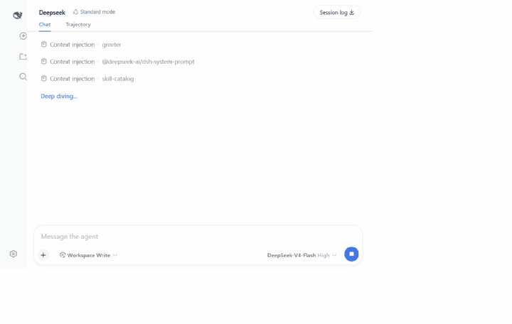
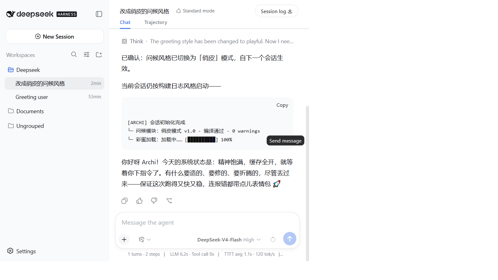

# dsh-plugin-greeter

A [DeepSeek Harness](https://github.com/deepseek-ai/deepseek-harness) (dsh) plugin that greets you at the start of every session — and remembers your name so every greeting feels personal.

**English** | [中文](README.zh.md)

## Features

- 👋 **Greets every session** — a friendly greeting with **fresh wording every time**, in the **same language you use** (the model improvises, so it never repeats).
- 🧑 **Learns your name** — on the first session it asks for your name, then persists it via the `remember_name` tool.
- 💾 **Remembers across sessions** — the name is stored in your dsh home (`~/.dsh/greeter-store.json`), so later sessions greet you **by name**.
- ✨ **Greets proactively** — opening a new session makes the agent greet you right away, **no first message needed**. (Set `proactive: false` to only greet after you send a message.)
- 🎨 **Switch styles by just asking** — say *"greet me like an engineer"* or *"use a playful greeting"* and the plugin changes the style for you — no config editing, no restart.

## Demo

**Greets you immediately** — open a new session and the agent greets you right away, no typing needed:



**Switch styles by just asking** — say *"use a playful greeting from now on"* and the plugin saves it for you:



## Install

### From npm

```sh
dsh plugin --profile web add dsh-plugin-greeter
```

The package declares `dsh.bundle.patch`, so `dsh plugin add` recognizes it as a bundle layer and it becomes part of the profile's patch stack automatically — no manual configuration required.

### From source (GitHub clone)

The repo ships its compiled output in `lib/`, so a fresh clone is usable without building:

```sh
git clone https://github.com/YohtHill/dsh-plugin-greeter.git
cd dsh-plugin-greeter
dsh plugin --profile web add .
```

> dsh's core packages are still pre-1.0 (`rc`). If you build from source yourself, use `npm install --legacy-peer-deps` (npm's default peer resolution rejects the `rc` ranges) and then `npm run build` before adding.

## Usage

After installing, **restart dsh**, then:

1. Start a **new session** — the agent greets you immediately, no typing required.
2. (Optional) send any message; the agent picks up from there.
3. On the first session it **asks your name** and remembers it via the `remember_name` tool; later sessions greet you **by name**.

> The proactive greeting runs one model call per new session. If you'd rather the agent only greet after your first message, set `proactive: false` (see Configuration).

**Switching styles is a conversation.** In any session, just say:

> *"从今天起用俏皮的风格问候我"* / *"greet me like an engineer from now on"* / *"回到随机风格吧"* / *"go back to random"*

The plugin calls its `set_greeting_style` tool, saves the choice, and it applies from the **next** session. Styles: `minimal`, `warm`, `practical`, `engineering`, `playful`, `calm`, or `random`.

> ⚠️ The greeting appears on the **first message of a new session** — it does not pop up when you just open the app. If you don't see it, make sure you created a new session and sent a message.

To verify the plugin is loaded: open **Settings → Plugins → Plugin list**, search `greeter`, and confirm the entry shows **Enabled**.

## Development (local, no publish needed)

From a DeepSeek Harness checkout, mount it as an overlay on any profile:

```sh
pnpm dsh web --patch /path/to/dsh-plugin-greeter/cordis.patch.yml
```

Or point the patch at your local source while iterating:

```yaml
- insert:
    - id: greeter
      name: '/absolute/path/to/dsh-plugin-greeter/src/index.ts'
```

> On Windows the `name` must be a `file:///` URL (drive-letter paths are not valid ESM specifiers).

## Build

```sh
npm install --legacy-peer-deps   # dsh peer deps are pre-1.0 (rc); npm needs this flag
npm run build                    # emits lib/ (JS + type declarations)
```

`npm publish` (or `npm pack`) rebuilds automatically via `prepack`.

## How it works

- Registers a `remember_name` tool via `defineTool`; the model calls it as soon as the user reveals their name, and the plugin persists it to the store file.
- Listens on the `agent/pre-step` waterfall and, on the first model step of each new session, injects a greeting instruction (context injection). Each session picks a **random tone cue** (playful, sincere, punchy, …), so the greeting differs even for identical user input.
- The store file is read fresh on every session, so editing or deleting it takes effect immediately.

### Configuration (optional)

No configuration is required — the default is adaptive (it follows your language and improvises a fresh greeting every session). The easiest way to customize is to **just ask in chat** (see [Usage](#usage) — the plugin saves your choice for you). If you prefer editing YAML, edit the **profile patch file** (`~/.dsh/profiles/web/cordis.patch.yml` for the `web` profile, or your profile's equivalent) and add a `config` block:

```yaml
- insert:
    - id: greeter
      name: 'dsh-plugin-greeter'
      config:
        style: engineering        # greeting tone: minimal | warm | practical | engineering | playful | calm
        language: zh              # fixed greeting language (omit to mirror the user)
        greetings:                # optional custom phrase pool (one picked per session)
          - '早上好，{name}！今天想让我帮你做什么？'
          - '嗨，{name}，欢迎回来！👋'
        nameFile: 'my-name.json'  # custom storage filename inside the dsh home
```

By default the greeting is **adaptive**: the model improvises fresh, conversational wording every session, mirrors the language you write in (English in → English greeting), and draws a **random tone** each time. The options below are optional overrides:

- `style` — fix the greeting tone: `minimal` (clean & short), `warm` (enthusiastic), `practical` (down to business), `engineering` (terse, technical, build-log vibe), `playful`, or `calm`. Omit for a random tone each session.
- `language` — force a fixed greeting language (e.g. `zh`, `en`, `ja`) instead of mirroring the user.
- `greetings` — an explicit pool of greeting phrases; the plugin **rotates** through them so consecutive sessions never repeat. Use `{name}` as a placeholder for the user's name.
- `nameFile` — custom storage filename inside the dsh home.
- `proactive` — greet immediately when a new session opens (default `true`); set `false` to only greet after your first message.

The config is validated with a Schemastery schema — invalid values **fail plugin load loudly** instead of being silently ignored.

## Compatibility

This plugin hooks dsh's internal agent pipeline (`agent/pre-step` context injection and the message source format). Verified against the dsh `0.1.0-rc.6`-era builds; if dsh changes those internals the plugin may stop greeting until it is updated. The plugin itself carries **no bundled dependencies** — it uses whatever dsh already ships, so installing it adds nothing to your profile's dependency tree.

### Plugin ↔ dsh version matrix

| dsh version | dsh-plugin-greeter |
| --- | --- |
| `0.1.0-rc.6` | ✅ verified (this release) |
| `0.1.0-rc.5` | ✅ verified (`0.1.x` releases up to `0.1.8`) |
| `< 0.1.0-rc.5` | ⚠️ untested — internals changed a lot during the rc series |

### Package manager notes

- The repo is **npm-first**: `package-lock.json` is the source of truth, and all build/test/lint commands (`npm run build`, `npm test`, `npm run lint`) use npm. Install with `npm install --legacy-peer-deps` (dsh peer deps are pre-1.0 `rc` ranges that npm's strict resolver rejects).
- `pnpm` is only used in the [local harness overlay](#development-local-no-publish-needed) workflow because the DeepSeek Harness checkout itself is a pnpm workspace — it is not required to build or test this plugin.

## Token usage & cost

The plugin's only recurring model cost is the **proactive greeting**: one short generation per new session (~130 output tokens). Its input (~8.6K tokens) is the shared system prompt, which dsh **prefix-caches across sessions** (≈99% cache hit), so the marginal cost is ≈ **$0.001 per session** with DeepSeek's cached-input pricing. Ordinary task turns cost exactly what any dsh session costs.

To spend **zero** extra on greetings, set `proactive: false` — the greeting then rides on your first message at no additional cost. The greeting instruction itself is kept short (~50 tokens) to minimize overhead.

## Publishing

```sh
npm login
npm publish
```

Then add the **`dsh-plugin`** topic to your GitHub repository so the community can find it.

## License

MIT

